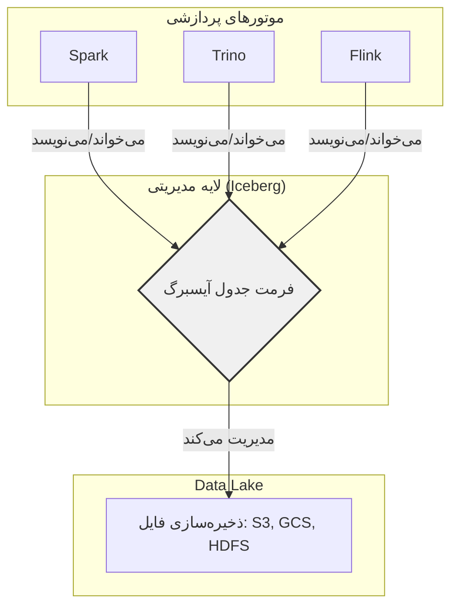
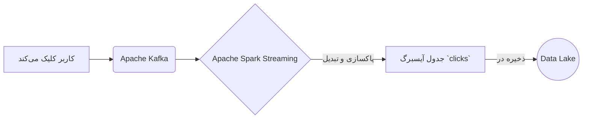
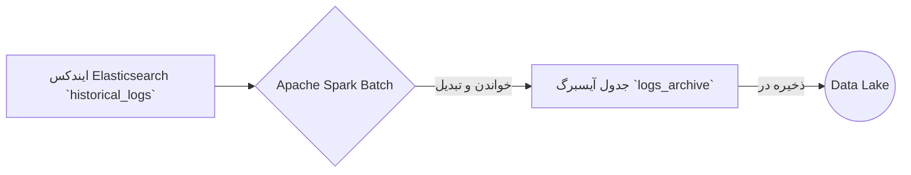
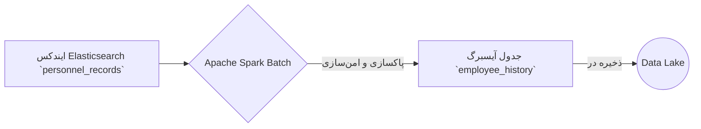
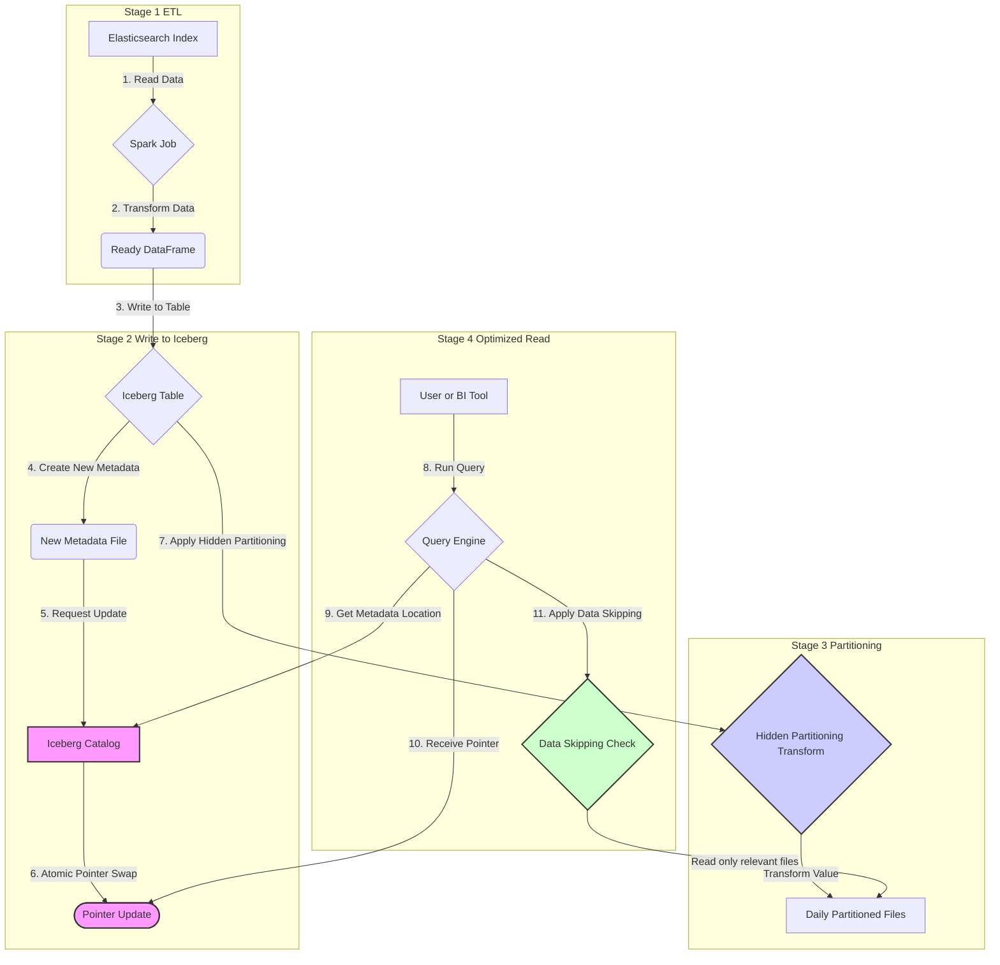

# مستند جامع Apache Iceberg

این مستند به صورت جامع به معرفی فرمت جدول متن‌باز آپاچی آیسبرگ، ویژگی‌های کلیدی، مفاهیم بنیادی و سناریوهای عملی استفاده از آن می‌پردازد.

---

## فصل اول: معرفی آیسبرگ و معماری Lakehouse

### آیسبرگ چیست؟

آیسبرگ یک فرمت جدول متن‌باز است که برای مدیریت مجموعه داده‌های تحلیلی در مقیاس بزرگ طراحی شده است. این فرمت به عنوان یک لایه مدیریتی روی ذخیره‌سازی‌های ارزانی مانند Google Cloud Storage یا AWS S3 عمل کرده و قابلیت اطمینان و سادگی جداول SQL را به دنیای داده‌های بزرگ (Big Data) می‌آورد. این ویژگی به موتورهای پردازشی مختلف مانند Spark، Trino، Flink و Hive اجازه می‌دهد تا با داده‌های یکسان به طور همزمان و ایمن کار کنند.

### آیسبرگ و معماری Lakehouse

آیسبرگ یکی از اجزای بنیادی برای ساخت یک معماری **Lakehouse** است. Lakehouse ترکیبی از بهترین ویژگی‌های **Data Lake** و **Data Warehouse** است.



---

## فصل دوم: ویژگی‌ها و مفاهیم کلیدی

### ویژگی‌های اصلی آیسبرگ

*   **تکامل طرح‌واره (Schema Evolution):** امکان اضافه، حذف یا تغییر نام ستون‌ها بدون نیاز به بازنویسی کل مجموعه داده.
*   **سفر در زمان و بازگشت (Time Travel and Rollback):** نگهداری تاریخچه‌ای از snapshotهای جدول برای پرس‌وجو از داده‌ها در یک نقطه زمانی خاص.
*   **پارتیشن‌بندی پنهان (Hidden Partitioning):** مدیریت خودکار پارتیشن‌بندی داده‌ها برای ساده‌سازی کوئری‌ها.
*   **سازگاری تراکنشی (ACID):** تضمین اتمی، سازگار، ایزوله و بادوام بودن عملیات داده.
*   **بهبود عملکرد پرس‌وجو (Improved Query Performance):** حذف فایل‌های داده غیرضروری با استفاده از فراداده برای افزایش سرعت کوئری.
*   **سازگاری بین موتورها (Cross-Engine Compatibility):** پشتیبانی از طیف گسترده‌ای از موتورهای پردازشی.

### مفاهیم بنیادی: نگاهی عمیق‌تر

برای درک قدرت واقعی آیسبرگ، باید با سه مفهوم کلیدی آن به صورت عمیق آشنا شویم:

**۱. کاتالوگ (Catalog): مغز متفکر و مرکز کنترل**

*   **شرح:** کاتالوگ قلب تپنده مدیریت جداول در آیسبرگ و **"منبع حقیقت" (Single Source of Truth)** است. وظیفه اصلی آن، نگاشت نام یک جدول به مکان فایل فراداده (metadata) **فعلی** آن است. هر عملیات نوشتن (commit) در آیسبرگ، یک فایل فراداده جدید ایجاد می‌کند. کاتالوگ در پایان هر تراکنش، با یک عملیات اتمی (atomic) اشاره‌گر را از فایل فراداده قدیمی به فایل جدید تغییر می‌دهد. این عملیات که "Compare-And-Swap" نام دارد، تضمین می‌کند که تغییرات یا به طور کامل اعمال می‌شوند یا اصلاً اعمال نمی‌شوند.
*   **انواع کاتالوگ:** آیسبرگ از کاتالوگ‌های متنوعی پشتیبانی می‌کند:
    *   **Hive Metastore:** رایج‌ترین گزینه برای سازگاری با اکوسیستم هدوپ.
    *   **Nessie:** یک کاتالوگ مدرن که قابلیت‌های Git-مانند (مانند branch و tag) را به جداول داده اضافه می‌کند.
    *   **JDBC:** برای ذخیره فراداده در پایگاه‌داده‌های رابطه‌ای.
    *   **REST-based:** یک پروتکل استاندارد برای ارتباط با سرویس‌های کاتالوگ.
*   **چرا اهمیت دارد؟**
    *   **تراکنش‌های اتمی (Atomic Commits):** کاربران هرگز یک حالت میانی و ناقص از جدول را نمی‌بینند.
    *   **جلوگیری از "مغزهای تقسیم‌شده" (Split Brain):** تمام موتورهای پردازشی (Spark, Trino, Flink) از یک منبع واحد برای پیدا کردن وضعیت فعلی جدول استفاده می‌کنند که از هرگونه ناهماهنگی جلوگیری می‌کند.

**۲. پارتیشن‌بندی پنهان (Hidden Partitioning): تکامل هوشمند ساختار داده**

*   **مشکل پارتیشن‌بندی سنتی (Hive-style):** در روش‌های قدیمی، ساختار فیزیکی پارتیشن‌ها بخشی از API جدول بود. برای مثال، کوئری‌ها باید شامل `WHERE year=2023 AND month=10` می‌شدند. این وابستگی شدید، تغییر استراتژی پارتیشن‌بندی را تقریباً غیرممکن می‌کرد، زیرا نیازمند بازنویسی کل جدول و به‌روزرسانی تمام کوئری‌ها بود.
*   **راه حل آیسبرگ:** آیسبرگ این وابستگی را با **پنهان‌سازی** جزئیات فیزیکی از کاربر، از بین می‌برد. شما به جای تعریف ساختار پوشه، یک **تابع تبدیل (transform function)** روی یک ستون تعریف می‌کنید.
    *   **مثال:** به جای پارتیشن‌بندی بر اساس پوشه‌های `year` و `month`، به آیسبرگ می‌گویید: "جدول را بر اساس ستون `event_time` و با تابع تبدیل `months` پارتیشن‌بندی کن". آیسبرگ به طور خودکار مقدار `2023-10-23T14:00:00` را به مقدار پارتیشن `2023-10` تبدیل می‌کند، اما کاربر همچنان کوئری خود را روی ستون اصلی می‌نویسد: `WHERE event_time > '2023-10-01'`.
*   **ویژگی انقلابی: تکامل پارتیشن‌بندی (Partition Evolution):** این قدرتمندترین ویژگی آیسبرگ است. فرض کنید پس از یک سال، تصمیم می‌گیرید که پارتیشن‌بندی ماهانه دیگر بهینه نیست و می‌خواهید بر اساس روز پارتیشن‌بندی کنید. شما به سادگی مشخصات پارتیشن (partition spec) جدول را به‌روز می‌کنید.
    *   **بدون بازنویسی:** داده‌های قدیمی با همان ساختار ماهانه باقی می‌مانند و داده‌های جدید با ساختار روزانه نوشته می‌شوند.
    *   **بدون تغییر کوئری:** آیسبرگ هر دو استراتژی را در فراداده خود مدیریت می‌کند و کوئری‌های کاربران بدون هیچ تغییری به درستی روی هر دو نوع داده کار می‌کنند.

**۳. پرش از داده (Data Skipping): ایندکس‌گذاری هوشمند بر اساس فراداده**

*   **شرح:** آیسبرگ به جای استفاده از ایندکس‌های سنگین سنتی (مانند B-Tree)، از ساختار فراداده چندلایه خود برای بهینه‌سازی و فیلتر کردن داده‌ها استفاده می‌کند. این ساختار یک هرم از اطلاعات است که به کوئری‌ها اجازه می‌دهد به سرعت فایل‌های غیرمرتبط را حذف کنند.

    *نمودار اصلاح شده ساختار فراداده:*
    ```mermaid
    graph TD
        subgraph Catalog [کاتالوگ: نقطه شروع]
            A(Pointer to current metadata)
        end

        subgraph Metadata Layer [لایه فراداده]
            B(table-metadata.json)
            B -- "شامل آمار کلی، اسکما و لیست مانیفست‌ها" --> C
        end
        
        subgraph Manifest Layer [لایه مانیفست]
            C(manifest-list.avro)
            C -- "شامل لیست فایل‌های مانیفست و آمار هر کدام (مثلا بازه مقادیر پارتیشن)" --> D1
            C --> D2
            
            D1(manifest-file-1.avro)
            D2(manifest-file-2.avro)
        end

        subgraph Data Layer [لایه داده]
            D1 -- "شامل لیست فایل‌های داده و آمار هر ستون در آنها (min/max)" --> E1
            D1 --> E2
            D2 -- "شامل لیست فایل‌های داده و آمار هر ستون در آنها (min/max)" --> E3
            
            E1[data-file-1.parquet]
            E2[data-file-2.parquet]
            E3[data-file-3.parquet]
        end

        A --> B
        style B fill:#f0f0f0,stroke:#333,stroke-width:2px,color:#333
        style C fill:#e0e0e0,stroke:#333,stroke-width:2px,color:#333
    ```

*   **چگونه کار می‌کند؟**
    در هر سطح از این هرم، آیسبرگ آمارهای دقیقی (مانند مقادیر حداقل و حداکثر برای هر ستون در هر فایل داده) را ذخیره می‌کند.
*   **مثال عملی:**
    فرض کنید کوئری زیر را اجرا می‌کنید: `SELECT * FROM logs WHERE level = 'ERROR' AND event_time > '2023-01-05'`.
    1.  **بررسی Manifest List:** آیسبرگ ابتدا به آمارهای موجود در `manifest-list` نگاه می‌کند. اگر یک فایل مانیفست فقط شامل داده‌های قبل از `2023-01-01` باشد، آیسبرگ آن فایل و **تمام فایل‌های داده زیرمجموعه‌اش** را نادیده می‌گیرد.
    2.  **بررسی Manifest File:** سپس، برای مانیفست‌های باقی‌مانده، آیسبرگ به آمارهای ستون `level` در هر فایل داده نگاه می‌کند. اگر مقدار حداقل و حداکثر برای ستون `level` در یک فایل داده خاص، `INFO` باشد، آن فایل داده نیز از اسکن حذف می‌شود، زیرا نمی‌تواند حاوی `ERROR` باشد.
*   **نتیجه:** این تکنیک که **Predicate Pushdown** نام دارد، میزان داده‌ای که باید خوانده و پردازش شود را به طور چشمگیری کاهش داده و سرعت کوئری‌ها را به خصوص در مجموعه داده‌های بسیار بزرگ، به شدت افزایش می‌دهد.

---

## فصل سوم: سناریوهای عملی

در این بخش، سه سناریوی واقعی برای درک بهتر کاربرد آیسبرگ ارائه می‌شود.

### سناریو ۱: پردازش جریانی (Streaming) کلیک‌های کاربران

*   **هدف:** تحلیل آنی کلیک‌های کاربران در یک فروشگاه آنلاین.
*   **جریان داده:**



### سناریو ۲: انتقال دسته‌ای (Batch) لاگ‌های تاریخی

*   **هدف:** انتقال ترابایت‌ها لاگ از Elasticsearch به Lakehouse برای کاهش هزینه و افزایش سرعت تحلیل.
*   **جریان داده:**



### سناریو ۳: آرشیو داده‌های پرسنلی

*   **هدف:** انتقال داده‌های حساس پرسنلی از Elasticsearch به یک Lakehouse امن.
*   **جریان داده:**



### سناریو ۴: خط لوله کامل ETL از Elasticsearch به Lakehouse

*   **هدف:** ساخت یک خط لوله (pipeline) کامل برای انتقال لاگ‌های برنامه از Elasticsearch به یک جدول آیسبرگ، بهینه‌سازی آن برای تحلیل و نمایش نحوه تعامل مفاهیم کلیدی آیسبرگ.



**شرح مراحل:**

1.  **خواندن داده:** یک فرآیند Spark به صورت دسته‌ای (batch) داده‌ها را از ایندکس `app_logs` در Elasticsearch می‌خواند.
2.  **تبدیل (ETL):** داده‌های خام (مثلاً در فرمت JSON) پاکسازی، تبدیل و به یک ساختار ستونی (DataFrame) مناسب برای تحلیل تبدیل می‌شوند.
3.  **نوشتن در آیسبرگ:** DataFrame پردازش‌شده در جدول آیسبرگ به نام `logs` نوشته می‌شود.
4.  **ایجاد فراداده جدید:** عملیات نوشتن، یک نسخه جدید از فایل فراداده (`metadata-v2.json`) ایجاد می‌کند که شامل اطلاعات مربوط به فایل‌های داده جدید است.
5.  **درخواست آپدیت کاتالوگ:** فرآیند نوشتن به **کاتالوگ** اطلاع می‌دهد که یک نسخه جدید از فراداده آماده است.
6.  **آپدیت اتمی:** **کاتالوگ** با یک عملیات اتمی (Compare-And-Swap)، اشاره‌گر جدول `logs` را از فایل فراداده قدیمی به `metadata-v2.json` تغییر می‌دهد. این کار تضمین می‌کند که هیچ کاربری حالت نیمه‌کاره را نمی‌بیند.
7.  **پارتیشن‌بندی پنهان:** جدول `logs` با استفاده از **پارتیشن‌بندی پنهان** بر اساس تابع `days` روی ستون `event_timestamp` پیکربندی شده است. آیسبرگ به طور خودکار مقادیر زمانی را به روز تبدیل کرده و داده‌ها را در ساختار فیزیکی مربوطه قرار می‌دهد، بدون اینکه کاربر نیازی به دانستن این جزئیات داشته باشد.
8.  **اجرای کوئری:** یک کاربر یا ابزار هوش تجاری (BI) یک کوئری برای پیدا کردن تمام لاگ‌های با سطح `ERROR` اجرا می‌کند.
9.  **ارتباط با کاتالوگ:** موتور کوئری (مانند Trino) برای پیدا کردن مکان جدول `logs` با **کاتالوگ** ارتباط برقرار می‌کند.
10. **دریافت فراداده:** کاتالوگ آدرس فایل فراداده فعلی (`metadata-v2.json`) را به موتور کوئری برمی‌گرداند.
11. **پرش از داده (Data Skipping):** موتور کوئری با استفاده از فراداده، به سراغ لیست مانیفست‌ها و آمارهای ذخیره‌شده در آن‌ها (مانند مقادیر حداقل و حداکثر ستون `level`) می‌رود. این فرآیند که نوعی **ایندکس‌گذاری** روی فراداده است، به موتور اجازه می‌دهد تا فایل‌های داده‌ای را که قطعاً حاوی `level = 'ERROR'` نیستند، از لیست خواندن **حذف** کند. این کار به شدت سرعت کوئری را افزایش می‌دهد.

---

## فصل چهارم: تاریخچه

آیسبرگ در ابتدا توسط **Netflix** و **Apple** برای رفع محدودیت‌های Apache Hive توسعه داده شد و اکنون یک پروژه سطح بالای آپاچی است که توسط شرکت‌های بزرگ فناوری برای مدیریت مجموعه داده‌های عظیم استفاده می‌شود.
