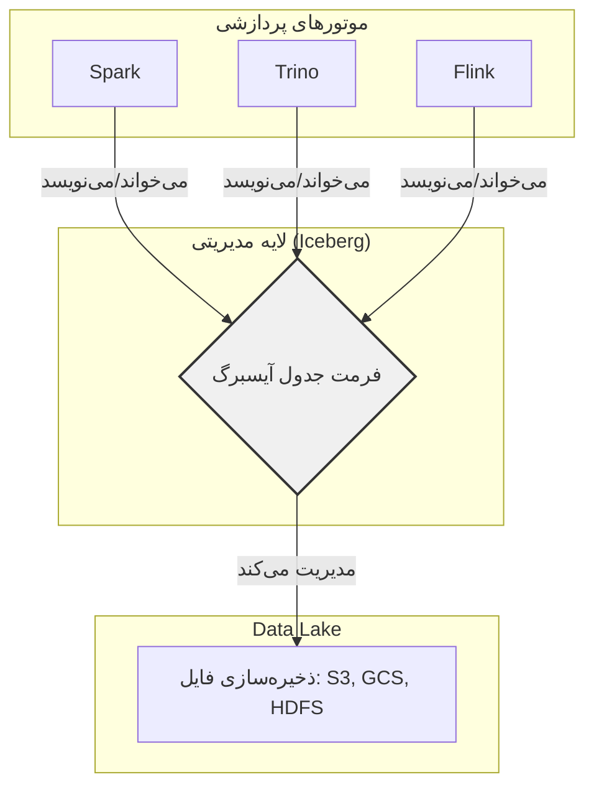
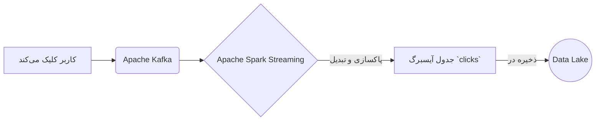
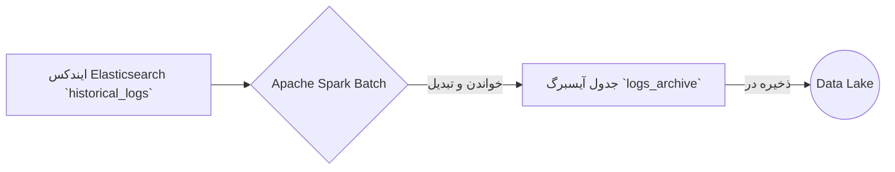
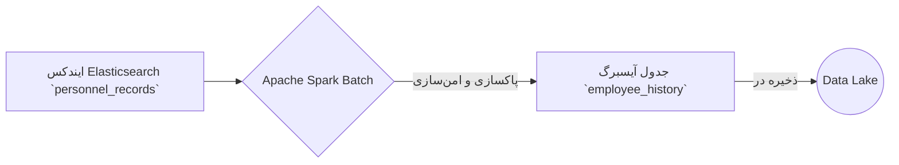
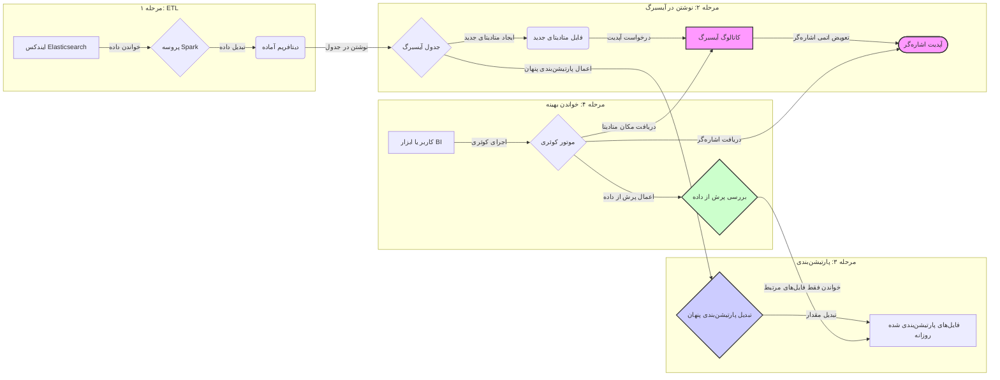

# مستند جامع Apache Iceberg

این مستند به صورت جامع به معرفی فرمت جدول متن‌باز آپاچی آیسبرگ، ویژگی‌های کلیدی، مفاهیم بنیادی و سناریوهای عملی استفاده از آن می‌پردازد.

---

## فصل اول: معرفی آیسبرگ و معماری Lakehouse

### آیسبرگ چیست؟

آیسبرگ یک فرمت جدول متن‌باز است که برای مدیریت مجموعه داده‌های تحلیلی در مقیاس بزرگ طراحی شده است. این فرمت به عنوان یک لایه مدیریتی روی ذخیره‌سازی‌های ارزانی مانند Google Cloud Storage یا AWS S3 عمل کرده و قابلیت اطمینان و سادگی جداول SQL را به دنیای داده‌های بزرگ (Big Data) می‌آورد. این ویژگی به موتورهای پردازشی مختلف مانند Spark، Trino، Flink و Hive اجازه می‌دهد تا با داده‌های یکسان به طور همزمان و ایمن کار کنند.

### آیسبرگ و معماری Lakehouse

آیسبرگ یکی از اجزای بنیادی برای ساخت یک معماری **Lakehouse** است. Lakehouse ترکیبی از بهترین ویژگی‌های **Data Lake** و **Data Warehouse** است.



---

## فصل دوم: ویژگی‌ها و مفاهیم کلیدی

### ویژگی‌های اصلی آیسبرگ

*   **تکامل طرح‌واره (Schema Evolution):** امکان اضافه، حذف یا تغییر نام ستون‌ها بدون نیاز به بازنویسی کل مجموعه داده.
*   **سفر در زمان و بازگشت (Time Travel and Rollback):** نگهداری تاریخچه‌ای از snapshotهای جدول برای پرس‌وجو از داده‌ها در یک نقطه زمانی خاص.
*   **پارتیشن‌بندی پنهان (Hidden Partitioning):** مدیریت خودکار پارتیشن‌بندی داده‌ها برای ساده‌سازی کوئری‌ها.
*   **سازگاری تراکنشی (ACID):** تضمین اتمی، سازگار، ایزوله و بادوام بودن عملیات داده.
*   **بهبود عملکرد پرس‌وجو (Improved Query Performance):** حذف فایل‌های داده غیرضروری با استفاده از فراداده برای افزایش سرعت کوئری.
*   **سازگاری بین موتورها (Cross-Engine Compatibility):** پشتیبانی از طیف گسترده‌ای از موتورهای پردازشی.

### مفاهیم بنیادی: نگاهی عمیق‌تر

برای درک قدرت واقعی آیسبرگ، باید با سه مفهوم کلیدی آن به صورت عمیق آشنا شویم:

**۱. کاتالوگ (Catalog): مغز متفکر و مرکز کنترل**

*   **شرح:** کاتالوگ قلب تپنده مدیریت جداول در آیسبرگ و **"منبع حقیقت" (Single Source of Truth)** است. وظیفه اصلی آن، نگاشت نام یک جدول به مکان فایل فراداده (metadata) **فعلی** آن است. هر عملیات نوشتن (commit) در آیسبرگ، یک فایل فراداده جدید ایجاد می‌کند. کاتالوگ در پایان هر تراکنش، با یک عملیات اتمی (atomic) اشاره‌گر را از فایل فراداده قدیمی به فایل جدید تغییر می‌دهد. این عملیات که "Compare-And-Swap" نام دارد، تضمین می‌کند که تغییرات یا به طور کامل اعمال می‌شوند یا اصلاً اعمال نمی‌شوند.
*   **انواع کاتالوگ:** آیسبرگ از کاتالوگ‌های متنوعی پشتیبانی می‌کند:
    *   **Hive Metastore:** رایج‌ترین گزینه برای سازگاری با اکوسیستم هدوپ.
    *   **Nessie:** یک کاتالوگ مدرن که قابلیت‌های Git-مانند (مانند branch و tag) را به جداول داده اضافه می‌کند.
    *   **JDBC:** برای ذخیره فراداده در پایگاه‌داده‌های رابطه‌ای.
    *   **REST-based:** یک پروتکل استاندارد برای ارتباط با سرویس‌های کاتالوگ.
*   **چرا اهمیت دارد؟**
    *   **تراکنش‌های اتمی (Atomic Commits):** کاربران هرگز یک حالت میانی و ناقص از جدول را نمی‌بینند.
    *   **جلوگیری از "مغزهای تقسیم‌شده" (Split Brain):** تمام موتورهای پردازشی (Spark, Trino, Flink) از یک منبع واحد برای پیدا کردن وضعیت فعلی جدول استفاده می‌کنند که از هرگونه ناهماهنگی جلوگیری می‌کند.

**۲. پارتیشن‌بندی پنهان (Hidden Partitioning): تکامل هوشمند ساختار داده**

*   **مشکل پارتیشن‌بندی سنتی (Hive-style):** در روش‌های قدیمی، ساختار فیزیکی پارتیشن‌ها بخشی از API جدول بود. برای مثال، کوئری‌ها باید شامل `WHERE year=2023 AND month=10` می‌شدند. این وابستگی شدید، تغییر استراتژی پارتیشن‌بندی را تقریباً غیرممکن می‌کرد، زیرا نیازمند بازنویسی کل جدول و به‌روزرسانی تمام کوئری‌ها بود.
*   **راه حل آیسبرگ:** آیسبرگ این وابستگی را با **پنهان‌سازی** جزئیات فیزیکی از کاربر، از بین می‌برد. شما به جای تعریف ساختار پوشه، یک **تابع تبدیل (transform function)** روی یک ستون تعریف می‌کنید.
    *   **مثال:** به جای پارتیشن‌بندی بر اساس پوشه‌های `year` و `month`، به آیسبرگ می‌گویید: "جدول را بر اساس ستون `event_time` و با تابع تبدیل `months` پارتیشن‌بندی کن". آیسبرگ به طور خودکار مقدار `2023-10-23T14:00:00` را به مقدار پارتیشن `2023-10` تبدیل می‌کند، اما کاربر همچنان کوئری خود را روی ستون اصلی می‌نویسد: `WHERE event_time > '2023-10-01'`.
*   **ویژگی انقلابی: تکامل پارتیشن‌بندی (Partition Evolution):** این قدرتمندترین ویژگی آیسبرگ است. فرض کنید پس از یک سال، تصمیم می‌گیرید که پارتیشن‌بندی ماهانه دیگر بهینه نیست و می‌خواهید بر اساس روز پارتیشن‌بندی کنید. شما به سادگی مشخصات پارتیشن (partition spec) جدول را به‌روز می‌کنید.
    *   **بدون بازنویسی:** داده‌های قدیمی با همان ساختار ماهانه باقی می‌مانند و داده‌های جدید با ساختار روزانه نوشته می‌شوند.
    *   **بدون تغییر کوئری:** آیسبرگ هر دو استراتژی را در فراداده خود مدیریت می‌کند و کوئری‌های کاربران بدون هیچ تغییری به درستی روی هر دو نوع داده کار می‌کنند.

**۳. پرش از داده (Data Skipping): ایندکس‌گذاری هوشمند بر اساس فراداده**

*   **شرح:** آیسبرگ به جای استفاده از ایندکس‌های سنگین سنتی (مانند B-Tree)، از ساختار فراداده چندلایه خود برای بهینه‌سازی و فیلتر کردن داده‌ها استفاده می‌کند. این ساختار یک هرم از اطلاعات است که به کوئری‌ها اجازه می‌دهد به سرعت فایل‌های غیرمرتبط را حذف کنند.

    *نمودار اصلاح شده ساختار فراداده:*
    ```mermaid
    graph TD
        subgraph Catalog [کاتالوگ: نقطه شروع]
            A(Pointer to current metadata)
        end

        subgraph Metadata Layer [لایه فراداده]
            B(table-metadata.json)
            B -- "شامل آمار کلی، اسکما و لیست مانیفست‌ها" --> C
        end
        
        subgraph Manifest Layer [لایه مانیفست]
            C(manifest-list.avro)
            C -- "شامل لیست فایل‌های مانیفست و آمار هر کدام (مثلا بازه مقادیر پارتیشن)" --> D1
            C --> D2
            
            D1(manifest-file-1.avro)
            D2(manifest-file-2.avro)
        end

        subgraph Data Layer [لایه داده]
            D1 -- "شامل لیست فایل‌های داده و آمار هر ستون در آنها (min/max)" --> E1
            D1 --> E2
            D2 -- "شامل لیست فایل‌های داده و آمار هر ستون در آنها (min/max)" --> E3
            
            E1[data-file-1.parquet]
            E2[data-file-2.parquet]
            E3[data-file-3.parquet]
        end

        A --> B
        style B fill:#f0f0f0,stroke:#333,stroke-width:2px,color:#333
        style C fill:#e0e0e0,stroke:#333,stroke-width:2px,color:#333
    ```

*   **چگونه کار می‌کند؟**
    در هر سطح از این هرم، آیسبرگ آمارهای دقیقی (مانند مقادیر حداقل و حداکثر برای هر ستون در هر فایل داده) را ذخیره می‌کند.
*   **مثال عملی:**
    فرض کنید کوئری زیر را اجرا می‌کنید: `SELECT * FROM logs WHERE level = 'ERROR' AND event_time > '2023-01-05'`.
    1.  **بررسی Manifest List:** آیسبرگ ابتدا به آمارهای موجود در `manifest-list` نگاه می‌کند. اگر یک فایل مانیفست فقط شامل داده‌های قبل از `2023-01-01` باشد، آیسبرگ آن فایل و **تمام فایل‌های داده زیرمجموعه‌اش** را نادیده می‌گیرد.
    2.  **بررسی Manifest File:** سپس، برای مانیفست‌های باقی‌مانده، آیسبرگ به آمارهای ستون `level` در هر فایل داده نگاه می‌کند. اگر مقدار حداقل و حداکثر برای ستون `level` در یک فایل داده خاص، `INFO` باشد، آن فایل داده نیز از اسکن حذف می‌شود، زیرا نمی‌تواند حاوی `ERROR` باشد.
*   **نتیجه:** این تکنیک که **Predicate Pushdown** نام دارد، میزان داده‌ای که باید خوانده و پردازش شود را به طور چشمگیری کاهش داده و سرعت کوئری‌ها را به خصوص در مجموعه داده‌های بسیار بزرگ، به شدت افزایش می‌دهد.

---

## فصل سوم: سناریوهای عملی

در این بخش، سه سناریوی واقعی برای درک بهتر کاربرد آیسبرگ ارائه می‌شود.

### سناریو ۱: پردازش جریانی (Streaming) کلیک‌های کاربران

*   **هدف:** تحلیل آنی کلیک‌های کاربران در یک فروشگاه آنلاین.
*   **جریان داده:**



### سناریو ۲: انتقال دسته‌ای (Batch) لاگ‌های تاریخی

*   **هدف:** انتقال ترابایت‌ها لاگ از Elasticsearch به Lakehouse برای کاهش هزینه و افزایش سرعت تحلیل.
*   **جریان داده:**



### سناریو ۳: آرشیو داده‌های پرسنلی

*   **هدف:** انتقال داده‌های حساس پرسنلی از Elasticsearch به یک Lakehouse امن.
*   **جریان داده:**



### سناریو ۴: خط لوله کامل ETL از Elasticsearch به Lakehouse

*   **هدف:** ساخت یک خط لوله (pipeline) کامل برای انتقال لاگ‌های برنامه از Elasticsearch به یک جدول آیسبرگ، بهینه‌سازی آن برای تحلیل و نمایش نحوه تعامل مفاهیم کلیدی آیسبرگ.



**شرح مراحل:**

1.  **خواندن داده:** یک فرآیند Spark به صورت دسته‌ای (batch) داده‌ها را از ایندکس `app_logs` در Elasticsearch می‌خواند.
2.  **تبدیل (ETL):** داده‌های خام (مثلاً در فرمت JSON) پاکسازی، تبدیل و به یک ساختار ستونی (DataFrame) مناسب برای تحلیل تبدیل می‌شوند.
3.  **نوشتن در آیسبرگ:** DataFrame پردازش‌شده در جدول آیسبرگ به نام `logs` نوشته می‌شود.
4.  **ایجاد فراداده جدید:** عملیات نوشتن، یک نسخه جدید از فایل فراداده (`metadata-v2.json`) ایجاد می‌کند که شامل اطلاعات مربوط به فایل‌های داده جدید است.
5.  **درخواست آپدیت کاتالوگ:** فرآیند نوشتن به **کاتالوگ** اطلاع می‌دهد که یک نسخه جدید از فراداده آماده است.
6.  **آپدیت اتمی:** **کاتالوگ** با یک عملیات اتمی (Compare-And-Swap)، اشاره‌گر جدول `logs` را از فایل فراداده قدیمی به `metadata-v2.json` تغییر می‌دهد. این کار تضمین می‌کند که هیچ کاربری حالت نیمه‌کاره را نمی‌بیند.
7.  **پارتیشن‌بندی پنهان:** جدول `logs` با استفاده از **پارتیشن‌بندی پنهان** بر اساس تابع `days` روی ستون `event_timestamp` پیکربندی شده است. آیسبرگ به طور خودکار مقادیر زمانی را به روز تبدیل کرده و داده‌ها را در ساختار فیزیکی مربوطه قرار می‌دهد، بدون اینکه کاربر نیازی به دانستن این جزئیات داشته باشد.
8.  **اجرای کوئری:** یک کاربر یا ابزار هوش تجاری (BI) یک کوئری برای پیدا کردن تمام لاگ‌های با سطح `ERROR` اجرا می‌کند.
9.  **ارتباط با کاتالوگ:** موتور کوئری (مانند Trino) برای پیدا کردن مکان جدول `logs` با **کاتالوگ** ارتباط برقرار می‌کند.
10. **دریافت فراداده:** کاتالوگ آدرس فایل فراداده فعلی (`metadata-v2.json`) را به موتور کوئری برمی‌گرداند.
11. **پرش از داده (Data Skipping):** موتور کوئری با استفاده از فراداده، به سراغ لیست مانیفست‌ها و آمارهای ذخیره‌شده در آن‌ها (مانند مقادیر حداقل و حداکثر ستون `level`) می‌رود. این فرآیند که نوعی **ایندکس‌گذاری** روی فراداده است، به موتور اجازه می‌دهد تا فایل‌های داده‌ای را که قطعاً حاوی `level = 'ERROR'` نیستند، از لیست خواندن **حذف** کند. این کار به شدت سرعت کوئری را افزایش می‌دهد.

---

## فصل چهارم: تاریخچه

آیسبرگ در ابتدا توسط **Netflix** و **Apple** برای رفع محدودیت‌های Apache Hive توسعه داده شد و اکنون یک پروژه سطح بالای آپاچی است که توسط شرکت‌های بزرگ فناوری برای مدیریت مجموعه داده‌های عظیم استفاده می‌شود.

---

## فصل پنجم: اصطلاحات کلیدی به زبان ساده

در این فصل، مفاهیم اصلی آیسبرگ را که ممکن است پیچیده به نظر برسند، به زبان ساده و روان توضیح می‌دهیم تا درک عمیق‌تری از قدرت این تکنولوژی پیدا کنید.

### ۱. کاتالوگ (Catalog) چیست؟

*   **به زبان ساده:** کاتالوگ مانند **فهرست یک کتابخانه** است. وقتی شما به دنبال کتاب خاصی (جدول داده) می‌گردید، به جای گشتن در تمام قفسه‌ها (فایل‌های ذخیره‌سازی)، به فهرست مراجعه می‌کنید و فهرست به شما می‌گوید کتاب دقیقاً در کدام قفسه و ردیف قرار دارد.
*   **وظیفه اصلی:** کاتالوگ در آیسبرگ، آدرس **آخرین نسخه سالم** از فراداده (metadata) جدول شما را نگه می‌دارد. هر بار که تغییری در جدول ایجاد می‌شود (مثلاً داده جدیدی اضافه می‌شود)، آیسبرگ یک فایل فراداده جدید می‌سازد. کاتالوگ در یک عملیات آنی و مطمئن (اتمی)، آدرس را از نسخه قدیمی به نسخه جدید تغییر می‌دهد.
*   **چه امکانی به ما می‌دهد؟**
    *   **اطمینان و سازگاری:** تضمین می‌کند که تمام ابزارها (مانند Spark و Trino) همیشه به یک نسخه واحد و معتبر از داده‌ها دسترسی دارند و از ناهماهنگی جلوگیری می‌شود.
    *   **تراکنش‌های امن:** تغییرات یا به طور کامل اعمال می‌شوند یا اصلاً اعمال نمی‌شوند. هیچ وقت داده‌ها در حالت نیمه‌کاره و خراب قرار نمی‌گیرند.

### ۲. پارتیشن‌بندی (Partitioning) چیست؟

*   **به زبان ساده:** پارتیشن‌بندی مانند **مرتب‌سازی لباس‌ها در کمد** است. شما می‌توانید تمام لباس‌هایتان را در یک کشوی بزرگ بریزید، اما پیدا کردن یک جوراب خاص بسیار زمان‌بر خواهد بود. به جای این کار، لباس‌ها را در کشوهای مختلف بر اساس نوع (پیراهن، شلوار، جوراب) دسته‌بندی می‌کنید.
*   **وظیفه اصلی:** در دنیای داده، پارتیشن‌بندی یعنی شکستن یک جدول بزرگ به قطعات کوچک‌تر و قابل مدیریت‌تر بر اساس یک ستون خاص. برای مثال، می‌توانید داده‌های فروش یک سال را بر اساس ماه یا روز پارتیشن‌بندی کنید.
*   **چه امکانی به ما می‌دهد؟**
    *   **افزایش سرعت کوئری:** وقتی شما به دنبال داده‌های ماه "فروردین" هستید، موتور کوئری فقط به سراغ پارتیشن مربوط به همان ماه می‌رود و بقیه داده‌ها را نادیده می‌گیرد. این کار حجم پردازش را به شدت کاهش می‌دهد.

### ۳. پارتیشن‌بندی پنهان (Hidden Partitioning) چیست؟

*   **به زبان ساده:** این ویژگی، نسخه هوشمندتر همان پارتیشن‌بندی است. فرض کنید در مثال کمد لباس، شما یک دستیار هوشمند دارید. شما فقط لباس را به او می‌دهید و می‌گویید "این یک پیراهن است". دستیار خودش تشخیص می‌دهد که باید آن را در کشوی پیراهن‌ها قرار دهد. شما نیازی به دانستن اینکه کدام کشو برای چیست، ندارید.
*   **وظیفه اصلی:** در پارتیشن‌بندی سنتی، شما باید در کوئری خود دقیقاً مشخص می‌کردید که کدام پارتیشن را می‌خواهید (مثلاً `WHERE sale_date_month = 'Farvardin'`). اما در پارتیشن‌بندی پنهان آیسبرگ، شما کوئری را روی ستون اصلی می‌نویسید (مثلاً `WHERE sale_timestamp > '2023-03-21'`). آیسبرگ خودش مقدار تاریخ را به پارتیشن ماهانه یا روزانه تبدیل کرده و داده‌های درست را پیدا می‌کند.
*   **چه امکانی به ما می‌دهد؟**
    *   **سادگی برای کاربر:** کاربران نیازی به دانستن ساختار فیزیکی و نحوه پارتیشن‌بندی داده‌ها ندارند و کوئری‌های ساده‌تری می‌نویسند.
    *   **تکامل پارتیشن‌بندی (Partition Evolution):** این بزرگترین مزیت است. شما می‌توانید استراتژی پارتیشن‌بندی را در طول زمان تغییر دهید (مثلاً از ماهانه به روزانه) بدون اینکه نیاز به بازنویسی داده‌های قدیمی یا تغییر کوئری‌های موجود داشته باشید. آیسبرگ هر دو ساختار را همزمان مدیریت می‌کند.

### ۴. ایندкс‌گذاری (Indexing) و پرش از داده (Data Skipping)

*   **به زبان ساده:** ایندکس‌گذاری در آیسبرگ مانند **فهرست موضوعی (Index) در انتهای یک کتاب** است. اگر به دنبال کلمه "کاتالوگ" در کتاب هستید، به جای ورق زدن کل کتاب، به فهرست موضوعی نگاه می‌کنید و صفحاتی که این کلمه در آن‌ها آمده را پیدا می‌کنید.
*   **وظیفه اصلی:** آیسبرگ به جای ساختن یک ایندکس جداگانه و سنگین، از خودِ **فراداده** به عنوان یک ایندکس هوشمند استفاده می‌کند. در هر لایه از فراداده، آمارهای دقیقی مانند **مقدار حداقل و حداکثر** برای هر ستون در هر فایل داده ذخیره می‌شود.
*   **چه امکانی به ما می‌دهد؟**
    *   **پرش از داده (Data Skipping):** وقتی شما کوئری می‌زنید (مثلاً `WHERE price > 50000`)، آیسبرگ ابتدا به این آمارها نگاه می‌کند. اگر در یک فایل داده، حداکثر قیمت ۴۵۰۰۰ باشد، آیسبرگ می‌فهمد که داده مورد نظر شما در آن فایل نیست و **از خواندن آن فایل صرف‌نظر می‌کند (پرش می‌کند)**. این کار باعث می‌شود فقط فایل‌های ضروری خوانده شوند و سرعت کوئری به طرز چشمگیری افزایش یابد.

### ۵. تفاوت کاتالوگ و ایندکس‌گذاری در چیست؟

*   **به زبان ساده:** بیایید دوباره به مثال کتابخانه برگردیم.
    *   **کاتالوگ (فهرست کتابخانه):** به شما می‌گوید که کتاب "تاریخ ایران" در **کدام قفسه** قرار دارد. کار کاتالوگ پیدا کردن **مکان کلی** کتاب (جدول) است.
    *   **ایندکس (فهرست موضوعی کتاب):** وقتی کتاب را پیدا کردید، فهرست موضوعی به شما می‌گوید که بحث "انقلاب مشروطه" در **کدام صفحات** آن کتاب است. کار ایندکس پیدا کردن **داده‌های خاص در داخل** کتاب (جدول) است.

*   **خلاصه تفاوت:**
    *   **کاتالوگ (Catalog):** جواب سوال **"جدول `logs` کجاست؟"** را می‌دهد. موتور کوئری اول از کاتالوگ می‌پرسد تا مکان فایل اصلی فراداده را پیدا کند.
    *   **ایندکس‌گذاری (Indexing/Data Skipping):** جواب سوال **"کدام فایل‌های داده در جدول `logs` حاوی `level = 'ERROR'` هستند؟"** را می‌دهد. بعد از پیدا کردن جدول، موتور کوئری از آمارهای فراداده (ایندکس) استفاده می‌کند تا فایل‌های غیرمرتبط را نخواند.

*   **نتیجه‌گیری:** این دو با هم کار می‌کنند تا سرعت را به حداکثر برسانند. کاتالوگ به سرعت شما را به میز کارتان (جدول) می‌رساند و ایندکس‌گذاری کمک می‌کند تا از بین تمام اسناد روی میز، فقط موارد مرتبط را بررسی کنید.

---

## فصل ششم: نقشه راه یادگیری آیسبرگ

برای یادگیری و تسلط بر آیسبرگ، می‌توانید این نقشه راه را دنبال کنید. این مسیر از مفاهیم پایه شروع شده و به موضوعات پیشرفته ختم می‌شود.

```mermaid
graph TD
    subgraph "سطح ۱: مبانی و مفاهیم پایه"
        A[۱. درک مشکل: چرا به آیسبرگ نیاز داریم؟] --> B[۲. آشنایی با معماری Lakehouse]
        B --> C{۳. خواندن فصل‌های ۱ و ۲ این مستند}
        C --> D[۴. آشنایی با مفاهیم کاتالوگ و پارتیشن‌بندی]
    end

    subgraph "سطح ۲: شروع کار عملی"
        E[۵. راه‌اندازی یک محیط ساده با Docker و Spark] --> F[۶. ساخت اولین جدول آیسبرگ]
        F --> G{۷. اجرای کوئری‌های ساده (SELECT, INSERT)}
        G --> H[۸. آشنایی با Time Travel و Rollback]
    end

    subgraph "سطح ۳: مباحث پیشرفته"
        I[۹. درک عمیق پارتیشن‌بندی پنهان و تکامل آن] --> J[۱۰. بهینه‌سازی عملکرد با Data Skipping]
        J --> K{۱۱. مدیریت و نگهداری جداول (Maintenance)}
        K --> L[۱۲. یکپارچه‌سازی با ابزارهای دیگر (Trino, Flink)]
    end

    subgraph "سطح ۴: تسلط و کاربردهای واقعی"
        M[۱۳. پیاده‌سازی یک خط لوله ETL کامل] --> N[۱۴. کار با کاتالوگ‌های مختلف (Nessie, JDBC)]
        N --> O{۱۵. مشارکت در جامعه متن‌باز آیسبرگ}
    end

    A --> E
    E --> I
    I --> M

    style C fill:#ccf,stroke:#333,stroke-width:2px
    style G fill:#ccf,stroke:#333,stroke-width:2px
    style K fill:#ccf,stroke:#333,stroke-width:2px
    style O fill:#cfc,stroke:#333,stroke-width:2px
```

**توضیح مراحل:**

*   **سطح ۱ (مبانی):** در این مرحله، شما با دلایل به وجود آمدن آیسبرگ و مفاهیم اصلی آن مانند معماری Lakehouse، کاتالوگ و پارتیشن‌بندی آشنا می‌شوید. هدف این است که یک دید کلی و درست از جایگاه آیسبرگ پیدا کنید.
*   **سطح ۲ (عملی):** وقت آن است که دست به کار شوید! با استفاده از ابزارهایی مانند Docker و Spark، یک محیط آزمایشی راه‌اندازی کرده و اولین جدول خود را بسازید. عملیات پایه مانند درج و خواندن داده و همچنین قابلیت سفر در زمان (Time Travel) را تجربه کنید.
*   **سطح ۳ (پیشرفته):** در این سطح، به سراغ ویژگی‌های قدرتمند آیسبرگ می‌روید. یاد می‌گیرید که چگونه پارتیشن‌بندی پنهان به شما در مدیریت داده‌ها کمک می‌کند و چگونه با استفاده از پرش از داده (Data Skipping) کوئری‌های خود را بهینه کنید.
*   **سطح ۴ (تسلط):** شما اکنون یک کاربر حرفه‌ای آیسبرگ هستید. می‌توانید خطوط لوله داده کامل را طراحی و پیاده‌سازی کنید، با کاتالوگ‌های مختلف کار کنید و حتی با مشارکت در پروژه، به توسعه آن کمک کنید.
