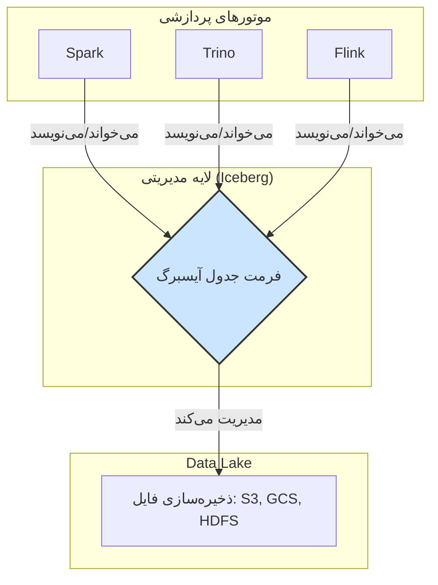
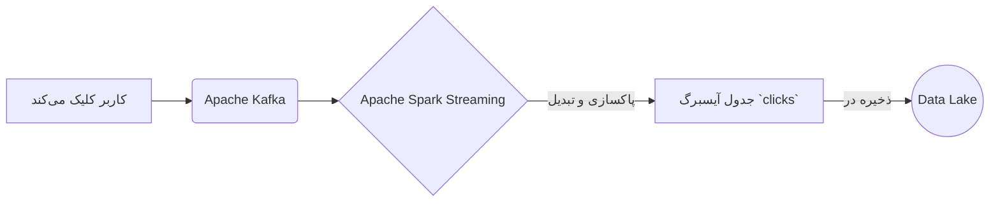
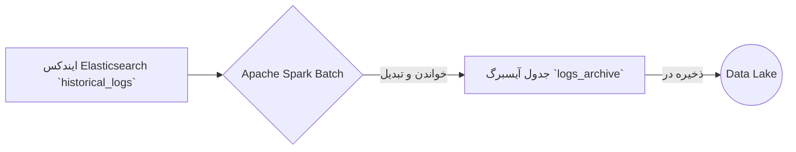
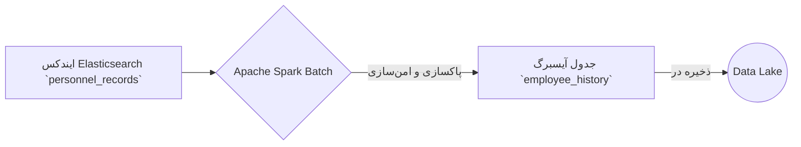

# مستند جامع Apache Iceberg

این مستند به صورت جامع به معرفی فرمت جدول متن‌باز آپاچی آیسبرگ، ویژگی‌های کلیدی، مفاهیم بنیادی و سناریوهای عملی استفاده از آن می‌پردازد.

---

## فصل اول: معرفی آیسبرگ و معماری Lakehouse

### آیسبرگ چیست؟

آیسبرگ یک فرمت جدول متن‌باز است که برای مدیریت مجموعه داده‌های تحلیلی در مقیاس بزرگ طراحی شده است. این فرمت به عنوان یک لایه مدیریتی روی ذخیره‌سازی‌های ارزانی مانند Google Cloud Storage یا AWS S3 عمل کرده و قابلیت اطمینان و سادگی جداول SQL را به دنیای داده‌های بزرگ (Big Data) می‌آورد. این ویژگی به موتورهای پردازشی مختلف مانند Spark، Trino، Flink و Hive اجازه می‌دهد تا با داده‌های یکسان به طور همزمان و ایمن کار کنند.

### آیسبرگ و معماری Lakehouse

آیسبرگ یکی از اجزای بنیادی برای ساخت یک معماری **Lakehouse** است. Lakehouse ترکیبی از بهترین ویژگی‌های **Data Lake** و **Data Warehouse** است.

---

## فصل دوم: ویژگی‌ها و مفاهیم کلیدی

### ویژگی‌های اصلی آیسبرگ

*   **تکامل طرح‌واره (Schema Evolution):** امکان اضافه، حذف یا تغییر نام ستون‌ها بدون نیاز به بازنویسی کل مجموعه داده.
*   **سفر در زمان و بازگشت (Time Travel and Rollback):** نگهداری تاریخچه‌ای از snapshotهای جدول برای پرس‌وجو از داده‌ها در یک نقطه زمانی خاص.
*   **پارتیشن‌بندی پنهان (Hidden Partitioning):** مدیریت خودکار پارتیشن‌بندی داده‌ها برای ساده‌سازی کوئری‌ها.
*   **سازگاری تراکنشی (ACID):** تضمین اتمی، سازگار، ایزوله و بادوام بودن عملیات داده.
*   **بهبود عملکرد پرس‌وجو (Improved Query Performance):** حذف فایل‌های داده غیرضروری با استفاده از فراداده برای افزایش سرعت کوئری.
*   **سازگاری بین موتورها (Cross-Engine Compatibility):** پشتیبانی از طیف گسترده‌ای از موتورهای پردازشی.

### مفاهیم بنیادی

**۱. کاتالوگ (Catalog)**

*   **نقش:** کاتالوگ آدرس فراداده (metadata) جداول را نگه می‌دارد و به موتورهای پردازشی کمک می‌کند تا جداول را پیدا کنند.
*   **انواع:** Hive Metastore, AWS Glue, JDBC, Hadoop.

**۲. ایندکس‌گذاری و پرش از داده (Indexing and Data Skipping)**

*   **مکانیسم:** آیسبرگ به جای ایندکس‌های سنتی، از مقادیر حداقل و حداکثر (min/max) هر ستون در فایل‌های داده برای پرش از خواندن فایل‌های غیرمرتبط استفاده می‌کند. این تکنیک سرعت کوئری‌ها را به شدت افزایش می‌دهد.

**۳. جستجو و کوئری (Search and Querying)**

*   **روش:** جستجو در آیسبرگ از طریق کوئری‌های تحلیلی SQL با شرط `WHERE` انجام می‌شود و برای داده‌های ساختاریافته بهینه شده است. این قابلیت با موتورهای جستجوی متنی مانند Elasticsearch متفاوت است.

---

## فصل سوم: سناریوهای عملی

در این بخش، سه سناریوی واقعی برای درک بهتر کاربرد آیسبرگ ارائه می‌شود.

### سناریو ۱: پردازش جریانی (Streaming) کلیک‌های کاربران

*   **هدف:** تحلیل آنی کلیک‌های کاربران در یک فروشگاه آنلاین.
*   **جریان داده:**

### سناریو ۲: انتقال دسته‌ای (Batch) لاگ‌های تاریخی

*   **هدف:** انتقال ترابایت‌ها لاگ از Elasticsearch به Lakehouse برای کاهش هزینه و افزایش سرعت تحلیل.
*   **جریان داده:**

### سناریو ۳: آرشیو داده‌های پرسنلی

*   **هدف:** انتقال داده‌های حساس پرسنلی از Elasticsearch به یک Lakehouse امن.
*   **جریان داده:**

---

## فصل چهارم: تاریخچه

آیسبرگ در ابتدا توسط **Netflix** و **Apple** برای رفع محدودیت‌های Apache Hive توسعه داده شد و اکنون یک پروژه سطح بالای آپاچی است که توسط شرکت‌های بزرگ فناوری برای مدیریت مجموعه داده‌های عظیم استفاده می‌شود.
