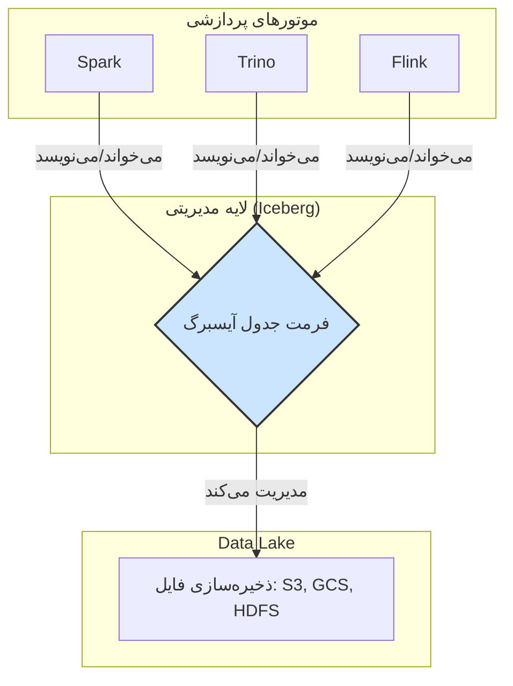
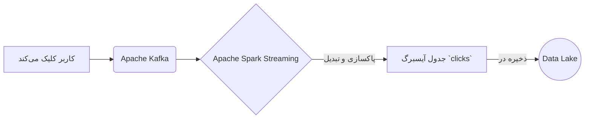
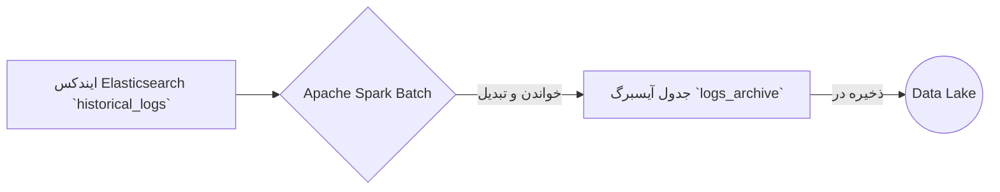
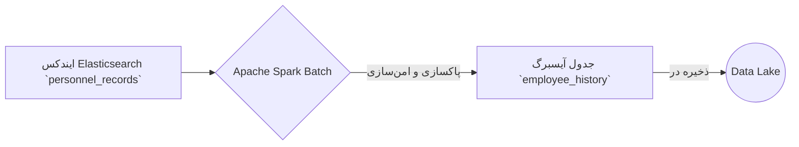

# مستند جامع Apache Iceberg

این مستند به صورت جامع به معرفی فرمت جدول متن‌باز آپاچی آیسبرگ، ویژگی‌های کلیدی، مفاهیم بنیادی و سناریوهای عملی استفاده از آن می‌پردازد.

---

## فصل اول: معرفی آیسبرگ و معماری Lakehouse

### آیسبرگ چیست؟

آیسبرگ یک فرمت جدول متن‌باز است که برای مدیریت مجموعه داده‌های تحلیلی در مقیاس بزرگ طراحی شده است. این فرمت به عنوان یک لایه مدیریتی روی ذخیره‌سازی‌های ارزانی مانند Google Cloud Storage یا AWS S3 عمل کرده و قابلیت اطمینان و سادگی جداول SQL را به دنیای داده‌های بزرگ (Big Data) می‌آورد. این ویژگی به موتورهای پردازشی مختلف مانند Spark، Trino، Flink و Hive اجازه می‌دهد تا با داده‌های یکسان به طور همزمان و ایمن کار کنند.

### آیسبرگ و معماری Lakehouse

آیسبرگ یکی از اجزای بنیادی برای ساخت یک معماری **Lakehouse** است. Lakehouse ترکیبی از بهترین ویژگی‌های **Data Lake** و **Data Warehouse** است.



---

## فصل دوم: ویژگی‌ها و مفاهیم کلیدی

### ویژگی‌های اصلی آیسبرگ

*   **تکامل طرح‌واره (Schema Evolution):** امکان اضافه، حذف یا تغییر نام ستون‌ها بدون نیاز به بازنویسی کل مجموعه داده.
*   **سفر در زمان و بازگشت (Time Travel and Rollback):** نگهداری تاریخچه‌ای از snapshotهای جدول برای پرس‌وجو از داده‌ها در یک نقطه زمانی خاص.
*   **پارتیشن‌بندی پنهان (Hidden Partitioning):** مدیریت خودکار پارتیشن‌بندی داده‌ها برای ساده‌سازی کوئری‌ها.
*   **سازگاری تراکنشی (ACID):** تضمین اتمی، سازگار، ایزوله و بادوام بودن عملیات داده.
*   **بهبود عملکرد پرس‌وجو (Improved Query Performance):** حذف فایل‌های داده غیرضروری با استفاده از فراداده برای افزایش سرعت کوئری.
*   **سازگاری بین موتورها (Cross-Engine Compatibility):** پشتیبانی از طیف گسترده‌ای از موتورهای پردازشی.

### مفاهیم بنیادی: نگاهی عمیق‌تر

برای درک قدرت واقعی آیسبرگ، باید با سه مفهوم کلیدی آن به صورت عمیق آشنا شویم:

**۱. کاتالوگ (Catalog): مدیر ارشد جداول**

*   **شرح:** کاتالوگ به عنوان **"منبع حقیقت" (Single Source of Truth)** برای جداول آیسبرگ عمل می‌کند. وظیفه اصلی آن، نگاشت نام یک جدول به مکان فایل فراداده (metadata) فعلی آن است. هر عملیات نوشتن در آیسبرگ، یک فایل فراداده جدید ایجاد می‌کند. در پایان، کاتالوگ با یک عملیات اتمی (atomic) و آنی، اشاره‌گر را از فایل قدیمی به فایل جدید تغییر می‌دهد.
*   **امکانات کلیدی:**
    *   **تراکنش‌های اتمی (Atomic Commits):** این مکانیزم تضمین می‌کند که کاربران یا نسخه قدیمی جدول را می‌بینند یا نسخه جدید را، و هرگز یک حالت میانی و ناقص را مشاهده نمی‌کنند.
    *   **جلوگیری از "مغزهای تقسیم‌شده" (Split Brain):** تمام موتورهای پردازشی از یک منبع واحد برای پیدا کردن جداول استفاده می‌کنند که از ناهماهنگی جلوگیری می‌کند.

**۲. پارتیشن‌بندی پنهان (Hidden Partitioning): انعطاف‌پذیری در ساختار داده**

*   **مشکل پارتیشن‌بندی سنتی (مانند Hive):** در روش‌های قدیمی، ساختار فیزیکی پارتیشن‌ها (مانند `year=2023/month=10`) در کوئری‌ها نیز باید ذکر می‌شد. تغییر این ساختار نیازمند بازنویسی کل جدول بود که عملیاتی بسیار پرهزینه است.
*   **راه حل آیسبرگ:** آیسبرگ این وابستگی را از بین می‌برد. شما به آیسبرگ می‌گویید که یک ستون (مانند `event_time`) را بر اساس یک واحد زمانی (مانند ماهانه) پارتیشن‌بندی کند. آیسبرگ خود مقدار ستون را به مقدار پارتیشن تبدیل می‌کند (مثلاً `2023-10-23T14:00:00` به `2023-10`).
*   **امکانات کلیدی:**
    *   **سادگی کوئری:** کاربران کوئری‌های خود را مستقیماً روی ستون اصلی می‌نویسند (`WHERE event_time > '2023-10-01'`) و نیازی به دانستن ساختار فیزیکی پارتیشن‌ها ندارند.
    *   **تکامل پارتیشن‌بندی (Partition Evolution):** این قدرتمندترین ویژگی آیسبرگ است. شما می‌توانید استراتژی پارتیشن‌بندی را در آینده تغییر دهید (مثلاً از ماهانه به روزانه) **بدون اینکه نیاز به بازنویسی داده‌های قدیمی باشد**. آیسبرگ هر دو استراتژی را در فراداده خود نگه می‌دارد و کوئری‌ها همچنان به درستی کار می‌کنند.

**۳. پرش از داده (Data Skipping): بهینه‌سازی هوشمند کوئری**

*   **شرح:** آیسبرگ به جای ایندکس‌های سنتی، از یک ساختار فراداده سلسله‌مراتبی برای بهینه‌سازی کوئری‌ها استفاده می‌کند.

    ```mermaid
    graph TD
        A[Catalog] --> B(Current Metadata File);
        B --> C{Manifest List};
        C --> D1[Manifest File 1];
        C --> D2[Manifest File 2];
        D1 --> E1[Data File 1 (Parquet)];
        D1 --> E2[Data File 2 (Parquet)];
        D2 --> E3[Data File 3 (Parquet)];
    ```

    در هر سطح از این هرم، آیسبرگ آمار دقیقی (مانند مقادیر حداقل و حداکثر هر ستون) را ذخیره می‌کند.
*   **امکانات کلیدی:**
    *   **افزایش چشمگیر سرعت کوئری:** وقتی یک کوئری با شرط `WHERE` اجرا می‌شود، آیسبرگ ابتدا به آمارهای ذخیره‌شده در سطوح بالای فراداده نگاه می‌کند. اگر شرط کوئری با بازه مقادیر یک فایل Manifest یا یک فایل داده همخوانی نداشته باشد، آیسبرگ از خواندن آن فایل و تمام فایل‌های زیرمجموعه‌اش **صرف‌نظر می‌کند**. این تکنیک به طور چشمگیری میزان داده‌ای که باید خوانده شود را کاهش داده و سرعت کوئری‌ها را به خصوص در مجموعه داده‌های بسیار بزرگ، به شدت افزایش می‌دهد.

---

## فصل سوم: سناریوهای عملی

در این بخش، سه سناریوی واقعی برای درک بهتر کاربرد آیسبرگ ارائه می‌شود.

### سناریو ۱: پردازش جریانی (Streaming) کلیک‌های کاربران

*   **هدف:** تحلیل آنی کلیک‌های کاربران در یک فروشگاه آنلاین.
*   **جریان داده:**



### سناریو ۲: انتقال دسته‌ای (Batch) لاگ‌های تاریخی

*   **هدف:** انتقال ترابایت‌ها لاگ از Elasticsearch به Lakehouse برای کاهش هزینه و افزایش سرعت تحلیل.
*   **جریان داده:**



### سناریو ۳: آرشیو داده‌های پرسنلی

*   **هدف:** انتقال داده‌های حساس پرسنلی از Elasticsearch به یک Lakehouse امن.
*   **جریان داده:**



---

## فصل چهارم: تاریخچه

آیسبرگ در ابتدا توسط **Netflix** و **Apple** برای رفع محدودیت‌های Apache Hive توسعه داده شد و اکنون یک پروژه سطح بالای آپاچی است که توسط شرکت‌های بزرگ فناوری برای مدیریت مجموعه داده‌های عظیم استفاده می‌شود.
